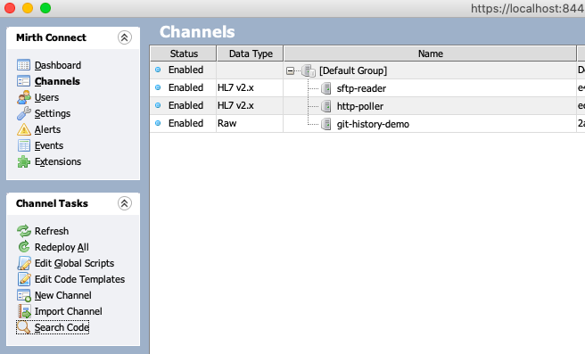
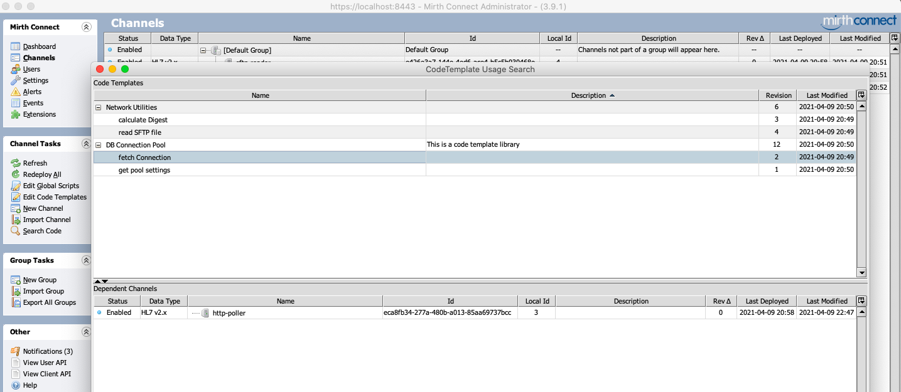

## Code Template References

This is a plugin using which one can find what channels are dependent on a selected CodeTemplate or CodeTemplate library

### Supported MirthConnect Versions
3.10.0, 3.9.1 and 3.9.0

### Building
JDK v1.8 and Maven v3.6.0 are the minimum requirements to build.
* git clone https://github.com/kayyagari/ct-refs.git
* mvn clean package

The final artifact(ct-refs-package-XXX.jar) can be found under `package/target` folder.

### Usage
After installing the plugin:
1. Launch MC client
2. Click on `Channels` task and then on `Search Code` task
3. Double clicking on the `CodeTemplate` row (represented by leaf nodes in the tabletree) will fetch all the channels that use one or more functions defined in the selected CodeTemplate.
4. Double clicking on the `CodeTemplateLibrary` row (represented by root nodes in the tabletree) will fetch all the channels that have the selected library as a dependency.

Note that `CodeTemplate` searches may return channels even if they have a string matching the name of the function, e.g., a comment block containing the exact function call

### Some Screenshots
##### 1. Path to The `Search Code` Task

##### 2. Search Window

### License
[MPL v2.0](https://github.com/kayyagari/ct-refs/blob/master/LICENSE.txt)